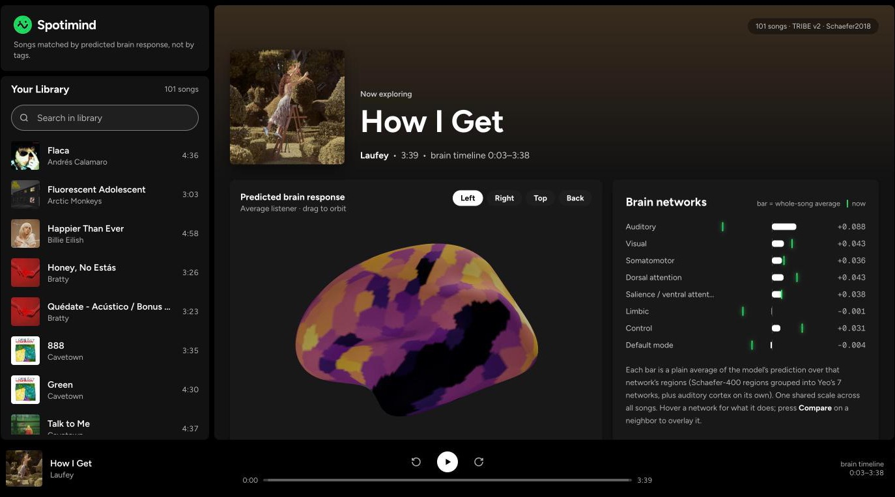
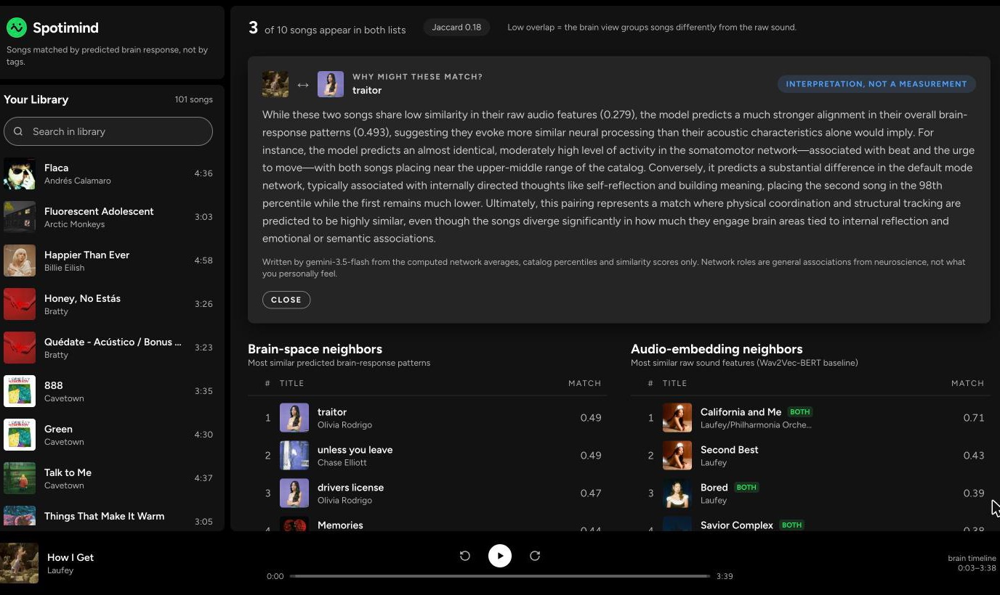

# Spotimind

Find songs that feel alike by how a brain is predicted to respond to them, not by tempo or genre.

Streaming apps decide two songs are alike from numbers like tempo, energy or who sings them. That's how you end up with songs that match on paper and feel nothing alike. I wanted to try the opposite: ask a model of the human brain how it would react to each song, second by second, and match songs by *that*.

The model is Meta's [TRIBE v2](https://github.com/facebookresearch/tribev2), which predicts fMRI brain activity from audio without a scanner. It runs once over your songs on a free Colab GPU. After that, the app runs on your laptop, no GPU needed.



## What you see

- **A 3D brain that lights up with the song.** Press play and the cortex follows the music, one predicted reading per second, smoothly interpolated.
- **Brain networks.** How much each of 8 networks (auditory, visual, attention, default mode…) responds on average over the song, plus a green marker for *right now*.
- **Two kinds of neighbors, side by side.** On the left, the songs whose predicted brain response is most similar. On the right, the songs that simply *sound* most similar (raw audio features). Songs in both lists are marked, with a count of how much the lists agree.
- **Compare.** Overlay a neighbor's networks on top of the current song's.
- **Why?** Gemini explains a match using only the computed numbers: which networks agree, which don't, and what those networks are usually associated with. It's labelled *interpretation, not a measurement*, because that's what it is.

## What I found

I ran it on 101 of my own songs: 38 minutes on a free T4, no failures.

- **The raw sound mostly finds the same artist.** Laufey's *How I Get* gets three more Laufey songs as its audio neighbors.
- **The brain view crosses artists and languages.** The same song's brain neighbors are Olivia Rodrigo's *traitor* and *drivers license*, and Chase Elliott's *unless you leave*.
- **The two views overlap, but not much.** On average 14% of the top-10 neighbors are shared (Jaccard 0.138), against about 5% for random lists. They're related, but they're clearly not the same thing.



## Honest limits

- **An average brain, not yours.** TRIBE v2 predicts the response of an averaged person. It says nothing about your taste.
- **Not trained on music.** It learned from people watching movies and listening to audiobooks. Music clearly lights up auditory cortex, but visual areas light up too, most likely a habit picked up from movies, where sounds come with something to see.
- **Slow and blurry.** About one reading per second, smeared over a few seconds. Trust the shape of a song, not individual beats.
- **A proxy.** "Similar predicted brain response" is a guess at "feels alike", not a measurement of it. The audio column is there to keep it honest.

## Run it yourself

You need [uv](https://docs.astral.sh/uv/) and Node 20+.

**Try it without songs or a GPU**

```bash
uv run --with numpy --with nilearn --with nibabel scripts/make_mock_data.py   # fake songs -> mock/

cd backend
SPOTIMIND_DATA_DIR=../mock/data SPOTIMIND_AUDIO_DIR=../mock/audio uv run uvicorn app.main:app --port 8000

cd frontend && npm install && npm run dev                                    # http://localhost:3000
```

It shows an orange **Mock data** badge so you never confuse it with the real thing.

**With your own songs**

1. Put your mp3s in Google Drive, in `MyDrive/spotimind/audio/`.
2. Open [`notebooks/01_embed_catalog.ipynb`](notebooks/01_embed_catalog.ipynb) in Colab, and pick **Runtime → Change runtime type → T4 GPU**.
3. Run the install cell. It restarts the runtime on purpose, so just continue with the next cell.
4. Mount Drive. If the popup fails, use **Files sidebar → Mount Drive** instead.
5. Run the rest. Every finished song is saved to `MyDrive/spotimind/output/work/`, so if Colab disconnects, rerun and it picks up where it stopped. The last cell downloads `spotimind_data.zip`.

No Hugging Face token needed: the audio-only path never loads the gated text model.

Then, in the repo:

```bash
unzip -o ~/Downloads/spotimind_data.zip -d data
uv run --with nilearn --with nibabel scripts/export_mesh.py --out data/mesh   # once
cp /path/to/your/mp3s/*.mp3 audio/                                            # the player streams from here

cd backend && uv run uvicorn app.main:app --port 8000
cd frontend && npm run dev
```

**Adding songs later:** drop the new mp3s in both `MyDrive/spotimind/audio` and `audio/`, rerun the notebook (it skips what's done) and unzip again.

**The "Why?" button:** create `backend/.env` with the line `GEMINI_API_KEY=your-key` ([get one here](https://aistudio.google.com/apikey)). That file is gitignored; never put a key in a file that gets committed. Without a key the button is simply disabled. If Gemini is busy, it retries and falls back to an older model before giving up.

<details>
<summary>Under the hood</summary>

**Pipeline**

1. **Prediction.** Each song (capped at 5 min) goes through TRIBE v2 with audio only: `[seconds, 20,484 points on the cortex]`. The first 3 s and last 2 s are dropped because the model is unreliable at the edges of any input.
2. **Regions and networks.** The points are averaged into 400 brain regions ([Schaefer 2018](https://github.com/ThomasYeoLab/CBIG/tree/master/stable_projects/brain_parcellation/Schaefer2018_LocalGlobal)), grouped into Yeo's 7 networks, plus auditory cortex split out using the Destrieux atlas. Every value is a plain average, and every assumption is written down in `data/networks.json`.
3. **Fingerprint.** Each song becomes 928 numbers: the mean and spread of every region, plus the shape of each network over 16 slices of the song. Features are compared across the whole catalog, not per song, so differences between songs survive.
4. **Audio baseline.** The same Wav2Vec-BERT features TRIBE listens with, averaged over the song (2,048 numbers).
5. **Matching.** Cosine similarity with NumPy. No database, no vector store, just files.

**Stack**

- **Colab** notebooks for the GPU part: TRIBE v2, nilearn, nibabel.
- **FastAPI** backend that loads everything into memory: neighbors, a binary timeline endpoint, audio streaming with seeking, embedded cover art, and Gemini via the Google GenAI SDK. 25 pytest tests run against generated mock data.
- **Next.js 16** with **react-three-fiber**: the cortex recolors every frame from typed arrays, with no allocations in the render loop. The design follows [`DESIGN.md`](DESIGN.md).

```
notebooks/   00_phase0_feasibility (what TRIBE actually outputs, speed, sanity checks), 01_embed_catalog
scripts/     export_mesh.py, make_mock_data.py, atlas.py
backend/     FastAPI app + tests
frontend/    Next.js app
docs/        DATA_CONTRACT.md: every file and endpoint, the single source of truth
```

**Known issues**

- TRIBE predicts in 100-second windows with no overlap, so there's a small jump at 1:40 and 3:20 into a song.
- The left/right order of TRIBE's output was checked indirectly (the two hemispheres respond almost identically, r = 0.97), not confirmed by the TRIBE repo.
- Five superior-temporal regions overlap auditory anatomy but stay in Yeo's default network, because only somatomotor regions are moved to auditory.

</details>

## License

TRIBE v2's code and weights are [CC BY-NC 4.0](https://creativecommons.org/licenses/by-nc/4.0/), so this is a non-commercial project. Audio files, model weights and keys are never committed.

Inspired by [Reeled In](https://github.com/sxnnywu/reeled-in), which used TRIBE v2 to score short videos, and a TRIBE-on-songs demo by @Baconbrix.
